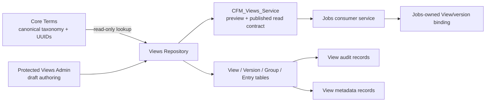

# DV-ARCH002 — Future Expansion Preservation Audit

Status: Complete — audit only  
Date: 2026-08-05  
Inspected implementation commit: Profilaxes `c6b3c0b97f32161760494de92857fb3566b1732e`  
Inspected continuity head: `f82fee4`

## 1. Executive summary

Durable Views has a sound MVP preservation boundary. Core Terms remains the
taxonomy authority; View entries store stable Core Terms UUID references;
published versions are separated from drafts; Jobs consumes the published
service boundary; and consumer code does not assemble View composition.

The current model can support Save View, Save As, Clone View, version history,
draft experimentation, metadata expansion, import/export, and approval
workflow without replacing the MVP. Version lineage, `based_on_version_id`,
immutable published rows, JSON metadata, and the existing repository/service
boundary are useful extension seams.

Two limitations should remain visible before further UX expansion:

1. `version_term_scope` uniquely permits one occurrence of a term per inclusion
   mode per version. It prevents repeated placement of the same term with the
   same inclusion in different groups or presentation positions.
2. The resolver produces a flat `entries` list and separately populated groups;
   it does not yet model virtual presentation nodes, placement identity, or
   consumer-specific projections. Group membership is recovered from the entry
   row after flat resolution.

Neither limitation requires immediate schema change for the certified MVP.
They do require explicit decisions before repeated placements, virtual nodes,
inheritance, or materially different consumer projections are authorized.

## 2. Current architecture



Authority remains: Terms classify; Views compose presentation; Jobs consumes
and authorizes its own domain behavior; WordPress authenticates.

## 3. Current schema inventory

| Table | Current purpose | Future preservation value | Current limitation |
|---|---|---|---|
| `wp_cfm_views` | Stable View identity, name, description, owner/visibility/status, current published version, extension metadata | Save View, Save As, templates, ownership and future family metadata can attach here | No explicit View-family/parent/template relationship |
| `wp_cfm_view_versions` | Immutable-ish version records, version number, lineage UUID, based-on version, lifecycle, validation, publication, restore fields | Version history, clone/branch ancestry, approval state extensions, draft experimentation | `lineage_uuid` is a grouping token, not a full branch/family graph; no explicit branch name or parent View |
| `wp_cfm_view_groups` | Version-scoped presentation containers with UUID, optional parent group, label, order, flags, JSON metadata | Richer groups, future nested/virtual containers, group presentation metadata | Current resolver/admin treat groups as concrete containers; parent hierarchy is not rendered as a virtual-node model |
| `wp_cfm_view_entries` | Version-scoped Core Terms UUID reference, framework, group, inclusion, order, label, flags, descendant intent, source, snapshots, JSON metadata, validation | Presentation metadata, import/export, provenance, draft composition | Unique `(version_id, term_uuid, inclusion)` blocks repeated same-inclusion placements |
| `wp_cfm_view_metadata` | One JSON metadata payload per target type/id with schema version and public flag | Extensible View/version/node/placement metadata without immediate columns | One payload per target; no first-class typed placement or consumer projection target |
| `wp_cfm_view_audit` | Append-only lifecycle/status audit envelope with actor, reason, hashes, correlation | Approval workflow, operational history, audit correlation | Current implementation records lifecycle actions, not every composition edit or approval decision |

Observed local counts at audit time: 2 Views, 2 versions, 1 group, 4 entries,
0 metadata rows, and 1 audit row.

## 4. Future capability compatibility matrix

| Future concept | Classification | Evidence / reason |
|---|---|---|
| Save View | Supported now | A View and draft version already persist independently; admin creates a View and draft. |
| Save As | Possible without schema change | Can create a new View and copy a version through the existing repository pattern; no UI operation exists today. |
| Clone View | Partially supported | `create_draft_from_version()` clones a version within a View and preserves lineage; cross-View clone orchestration is not exposed. |
| View version history | Partially supported | Version rows, numbers, lineage, publication, retirement, restore, and ancestry exist; no history browser or diff model exists. |
| View branching/families | Partially supported | `lineage_uuid` and `based_on_version_id` preserve ancestry; no explicit branch/family entity or cross-View family relation exists. |
| Richer presentation groups | Partially supported | Labels, descriptions, ordering, flags, parent ID, and JSON metadata exist; resolver semantics remain simple group containers. |
| Virtual/presentation nodes | Requires schema extension | Groups are the nearest seam, but entries are Core Terms placements and resolver output has no node type, placement ID, or virtual-node identity. |
| Reusable View templates | Possible without schema change for a first implementation | Clone/copy can use existing View/version/group/entry records; template identity, versioning, and governance would benefit from explicit metadata or a later relation. |
| Inheritance | Requires schema extension | No parent View/version inheritance relation or override/merge policy exists. `based_on_version_id` is ancestry, not live inheritance. |
| Consumer-specific presentation | Requires schema extension | Jobs receives a shared resolved model; no consumer projection, placement, or audience-specific overlay contract exists. |
| Multiple placements of same Core Term | Requires schema extension | `UNIQUE KEY version_term_scope (version_id, term_uuid, inclusion)` prevents repeated same-inclusion placements. |
| Import/export | Possible without schema change for a bounded first version | UUID, framework, group, version, metadata, and provenance fields are serializable; no canonical file contract or import validation service exists. |
| Approval workflows | Partially supported | Draft/review/published statuses, validation, actors, and audit envelope exist; approval roles, decisions, comments, and transitions are not modeled. |
| Analytics attachment points | Possible without schema change for attachment identity | View/version UUIDs and metadata/audit targets provide stable anchors; no analytics event contract or consumer-owned measurement boundary exists. |

No evaluated concept conflicts with the current authority boundary when
implemented as a View/platform concern. Consumer-specific behavior must remain
an explicit projection or consumer service contract, not duplicated View
composition in Jobs.

## 5. Persistence audit

- Cloning: safe for a bounded repository operation. The existing version clone
  copies groups and entries, maps group IDs, preserves UUID references, and
  carries lineage. Cross-View Save As needs explicit transaction and ownership
  orchestration but not a replacement model.
- Branching: version ancestry is present, but branch/family semantics are not.
  A future branch feature should not overload `based_on_version_id` as a live
  inheritance relation.
- Draft experimentation: safe. Draft-only guards prevent editing published
  versions, while preview and validation operate on draft data.
- Presentation nodes: not first-class. JSON metadata can carry experimental
  data, but durable virtual nodes should not be hidden indefinitely inside an
  entry or group metadata blob.
- Multiple placements: current unique key is the principal lock-in risk.
  A future placement identity would need to separate placement rows from
  canonical term references.
- Metadata expansion: strong near-term seam through `metadata_json`,
  `extension_metadata_json`, and the metadata table, provided metadata does
  not become a substitute for required relational identity.

## 6. Resolver audit

The resolver correctly reads canonical terms by framework/UUID, expands
descendants through Core Terms, applies include/exclude behavior, carries
presentation labels and metadata, and returns group-aware output through the
platform service. Jobs receives the service result rather than rebuilding it.

The current resolved shape is effectively:

```text
View
└── Version
    ├── Groups[]
    │   └── entries[]
    └── entries[]  (flat resolved presentation list)
```

It can represent ordinary grouped presentation and deterministic ordering. It
does not yet represent a first-class virtual container, a repeated placement
with independent metadata/order, a node graph, inheritance overlays, or
consumer-specific rendering differences. These are extension requirements,
not MVP defects.

## 7. UX-to-data-model analysis

| UX concept | Current data alignment | Audit finding |
|---|---|---|
| Core Terms Library | `CFM::get_terms()` read-only source | Correctly reflects Core Terms authority; safely reversible. |
| Current View | `cfm_views` plus selected draft version | Correct; the UI context matches the persistence boundary. |
| Groups | `cfm_view_groups` keyed to a version | Correct for current containers; do not assume this is the final virtual-node model. |
| Entries | `cfm_view_entries` with canonical UUID and presentation fields | Correct for one placement per term/inclusion; insufficient for repeated placements. |
| Presentation containers | Group labels/order/metadata | Partially aligned; future node identity is not explicit. |
| Save As | No current UI action; repository primitives are sufficient for bounded copy | Document as planned, not as currently available. |
| Versions | Version number, lineage, status, ancestry and immutable publication behavior | Strong backend alignment; history/branch UX is absent. |

The current UX is a truthful projection of the current model. It does not
promise nesting, virtual nodes, repeated placement, templates, or inheritance.

## 8. Lock-in risks and recommended preservation actions

| Finding | Classification | Recommendation |
|---|---|---|
| Core Terms UUID reference boundary | A. No action needed | Preserve the UUID-only contract. |
| Published version separation | A. No action needed | Continue treating published rows as immutable and create new drafts. |
| `based_on_version_id` and lineage semantics | B. Document decision | State that ancestry is historical provenance, not live inheritance or a branch graph. |
| Repeated same-inclusion placement blocked by unique key | E. Defer safely, with trigger | Revisit before any repeated placement or placement-specific metadata UX; then introduce a placement identity model rather than weakening uniqueness casually. |
| Groups assumed to be presentation nodes | B. Document decision | Treat groups as current containers; reserve a future node/placement abstraction. |
| No explicit View family/template relation | E. Defer safely | Use clone/metadata for first bounded workflows; add a relation only when family/template governance is authorized. |
| JSON metadata | A. No action needed for MVP | Use for extension metadata, not canonical identity, ordering, lineage, or authorization. |
| Lifecycle-only audit trail | E. Defer safely | Add composition/approval audit events only when approval or compliance requirements are authorized. |
| Consumer-specific leakage | A. No action needed | Keep Jobs on `CFM_Views_Service`; add projection contracts only for a demonstrated consumer need. |

## 9. Recommended documentation updates

1. Keep the administrator manual explicit that Save As, version history,
   branching, templates, inheritance, repeated placement, import/export, and
   approval UX are not current browser capabilities.
2. Add a durable architecture decision stating that `based_on_version_id` is
   ancestry only and must not be interpreted as inheritance.
3. Add a future placement/node vocabulary note distinguishing canonical term,
   View entry, placement, group, and virtual presentation node.
4. Keep Jobs integration documentation focused on binding/resolution and not
   View composition.

## 10. Recommended next sequence

1. No schema change for the current MVP or immediate authoring polish.
2. Document the ancestry-versus-inheritance and group-versus-node decisions.
3. If UX continues, prioritize version history/Save As as repository-safe
   workflows before virtual nodes or inheritance.
4. Before repeated placements, templates with independent placement metadata,
   or consumer-specific projections, authorize a dedicated placement/node
   design ticket and schema extension audit.
5. Before approval workflows, define actor/decision/comment semantics and
   extend audit records intentionally.

## 11. Verification record

Files/classes inspected:

- `wordpress/wp-content/plugins/profilaxes/includes/class-cfm-schema.php`
- `wordpress/wp-content/plugins/profilaxes/includes/class-cfm-views-repository.php`
- `wordpress/wp-content/plugins/profilaxes/includes/class-cfm-views-service.php`
- `wordpress/wp-content/plugins/profilaxes/admin/class-cfm-views-admin.php`
- `wordpress/wp-content/plugins/tnet-jobs/includes/services/class-tnet-jobs-durable-views-service.php`
- `docs/core-terms/durable-views-project-cursor.md`
- `docs/core-terms/durable-views-engineering-handoff.md`
- `docs/core-terms/durable-views-roadmap.md`

Tables inspected:

- `wp_cfm_views`
- `wp_cfm_view_versions`
- `wp_cfm_view_groups`
- `wp_cfm_view_entries`
- `wp_cfm_view_metadata`
- `wp_cfm_view_audit`

Browser behavior matched the architecture at the canonical workbench URL:
the authenticated draft page showed the read-only Core Terms Library, editable
Current View, three draggable entries, keyboard ordering fallback, validation,
and the established workflow. Current local data reported 2 Views, 2 versions,
1 group, 4 entries, 0 metadata rows, and 1 audit row. The UX assumptions are
safe to reverse because they are presentation-layer labels and interactions;
the repeated-placement uniqueness and flat resolver shape are the substantive
future constraints.

No implementation, schema, UX, or data changes were made by this audit.
