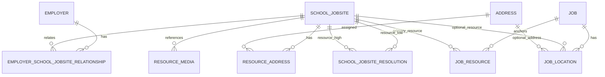

# DATA002 Implemented Domain Map v1

Status: Implemented schema reference
Implemented schema version: `0.9.8`
Nested implementation commit: `DATA003D-SCHEMA`
Source: `wordpress/wp-content/plugins/tnet-jobs/includes/class-tnet-jobs-schema.php`

This document records the seven additive tables originally implemented by DATA002 and the additive pairwise resolution table implemented by DATA003D-SCHEMA.

## DATA004-SCHEMA wizard draft persistence

The additive `tnet_jobs_wizard_drafts` table is the durable persistence boundary for the later Wizard Session & Draft Contract. It is intentionally separate from `tnet_jobs`; existing Job drafts remain owned and readable by the existing Jobs service.

The bounded DATA004 orchestration service is now implemented in the Jobs plugin as `TNet_Jobs_Wizard_Session_Service`. It owns session creation/resume, envelope hydration, Step 1 state persistence, validation-driven completion, transitions, stale-write handling, ownership checks, explicit identity-resolution invocation, and deterministic Step 1 domain-command preparation. It does not add UI, routes, publication, or production Step 1 integration.

The table stores `wizard_draft_id`, unique UUID `session_id`, nullable `job_id`, `employer_id`, `actor_user_id`, `mode`, `current_step`, JSON `completed_steps_json` and `step_states_json`, `draft_status`, integer `state_version`, `wizard_contract_version`, `domain_contract_version`, and created/updated/last-saved/expiration/archive timestamps. JSON payloads are bounded at 65,535 bytes per field and PHP object serialization is not permitted.

Indexes cover session uniqueness plus employer, actor, job, status, updated, and last-saved access. Repository updates require the expected `state_version`, increment it exactly once on success, and return a deterministic stale-write error without overwriting newer state. The repository is persistence-only; DATA004 orchestration remains future work.
It is downstream of the approved DATA001 architecture and is the schema
reference for DATA003 repositories, services, validation, authorization,
duplicate handling, and hydration.

## Scope and non-scope

Implemented: durable tables, identifiers, columns, timestamps, archive fields,
indexes, and uniqueness described below. Not implemented: repositories,
services, validation, authorization, duplicate workflows, hydration,
serialization, backfill, compatibility reads, foreign keys, geocoding, media
processing, or enforcement that every new Job has a resource.

## Entity map

### `tnet_jobs_school_jobsites`

Purpose: employer-scoped School/Jobsite resource identity. Primary key:
`school_jobsite_id`. Important columns: nullable `school_jobsite_uuid`, required
`full_name`, nullable `display_name`, `visibility` (default `private`), and `status`. Lifecycle: `created_at`,
`updated_at`, nullable `archived_at`. Indexes: UUID unique, `status`, truncated
`full_name`, and `archived_at`. No foreign keys. Future owner: resource
repository/service; validation and authorization are DATA003.

Visibility is independent of lifecycle. `private` is the implemented V1 default;
shared/public exposure is not activated by this schema ticket.

### `tnet_jobs_employer_school_jobsites`

Purpose: employer-to-resource relationship. Primary key:
`employer_school_jobsite_id`. Required columns: `employer_id`,
`school_jobsite_id`, `status`. Lifecycle: timestamps and nullable
`archived_at`. Unique constraint: `(employer_id, school_jobsite_id)`. Indexes:
employer, resource, and status. Future owner: relationship repository/service;
authorization belongs to DATA003.

### `tnet_jobs_addresses`

Purpose: reusable address value. Primary key: `address_id`. Required columns:
`country`, `full_name`; all address lines, city/state, locality/region, and
postal code are nullable. Lifecycle: timestamps and nullable `archived_at`.
Indexes: country, city/state, locality/country, postal code. The schema stores
both U.S. and international fields but does not enforce validity yet. Future
owner: address repository/service and validator.

### `tnet_jobs_resource_addresses`

Purpose: associate a School/Jobsite resource with an address. Primary key:
`resource_address_id`. Required columns: `school_jobsite_id`, `address_id`, and
`role` (default `primary`). Lifecycle: timestamps and nullable `archived_at`.
Unique constraint: `(school_jobsite_id, role)`, which supports one row per role,
not application-level validation of the primary role. Indexes: resource,
address, role. Future owner: resource-address repository/service.

### `tnet_jobs_resource_media`

Purpose: storage reference for resource media. Primary key: `resource_media_id`.
Required `school_jobsite_id` and `role` (default `primary_image`); nullable
`attachment_id`, `media_identifier`, and `provenance`. Lifecycle: timestamps and
nullable `archived_at`. Unique constraint: `(school_jobsite_id,
media_identifier)`; nullable identifiers remain possible. Indexes: resource,
attachment, role. No upload or processing behavior. Future owner: media
reference repository/service.

### `tnet_jobs_job_resources`

Purpose: associate a Job with its School/Jobsite resource. Primary key:
`job_resource_id`. Required `job_id`, `school_jobsite_id`, and `role` (default
`primary`). Lifecycle: timestamps and nullable `archived_at`. Unique constraint:
`(job_id, role)`, which provides one row for the `primary` role but does not
enforce that a primary row exists. Indexes: job, resource, role. Future owner:
Job-resource repository/service and primary-resource validator.

### `tnet_jobs_job_locations`

Purpose: additional job locations and job-specific overrides. Primary key:
`job_location_id`. Required `job_id` and `location_role` (default `additional`);
nullable `school_jobsite_id`, `address_id`, and all override fields. Lifecycle:
timestamps and nullable `archived_at`. Indexes: job, resource, address, role.
Future owner: job-location repository/service and location validator. No
rendering, search, geocoding, or override resolution is implemented.

### `tnet_jobs_school_jobsite_resolutions`

Purpose: globally scoped pairwise identity-resolution decision. Primary key:
`resolution_id`. Canonical pair columns `resource_low_id` and
`resource_high_id` store the lesser and greater SchoolJobsite IDs and have a
unique constraint together; self-pairs are rejected by the repository. Evidence
columns preserve confidence band/score and matched/conflicting signal JSON.
Decision fields are `decision`, `reason_code`, `resolution_source`,
`actor_user_id`, `resolved_at`, `identity_snapshot_hash`, and active/archive
lifecycle fields. Indexes cover each resource, status, and snapshot hash. No
employer scope and no merge behavior are represented.

## Relationship diagram

Plain-text fallback: Employer → EmployerSchoolJobsiteRelationship →
SchoolJobsite → ResourceAddress → Address; SchoolJobsite → ResourceMedia; SchoolJobsite ↔ SchoolJobsiteResolution; Job →
JobResource → SchoolJobsite; Job → JobLocation → optional SchoolJobsite and/or
address/override. These are logical relationships represented by IDs; the
schema adds no foreign-key constraints.

## Invariants

### Implemented schema invariants

- Primary keys are auto-incrementing unsigned BIGINT identifiers.
- Required columns and defaults are enforced at table definition level.
- Employer/resource pairs are unique.
- Resource/role, resource-media identifier, and Job/role pairs have declared
  uniqueness as documented above.
- All seven tables have created/updated timestamps; all seven have nullable
  archive fields.
- No foreign keys are declared.
- Work Arrangement is not represented in these tables; it remains separate from
  the Primary Resource concept.

### Target application invariants not yet enforced

- Every new wizard-created Job must have exactly one Primary Resource.
- Legacy Jobs may remain nullable only during migration/backfill.
- A resource's primary address and primary media must be valid application-level
  selections, not merely rows with a role string.
- U.S./international address validity rules require validation.
- Employer relationship access requires authorization and trusted-member rules.
- Duplicate Create / Reuse / Relate / Resolve requires confidence scoring and
  workflow services.
- Pairwise resolution persistence is implemented, but confidence scoring,
  candidate retrieval, outcome orchestration, snapshot hash generation, and
  merge proposal workflow remain DATA003D service responsibilities.

## DATA003 ownership map

1. Resource and relationship repositories: SchoolJobsite and employer-resource
   persistence; depend on identity and relationship uniqueness.
2. Address/media repositories: address and storage-reference persistence; no
   upload pipeline.
3. Job-resource/location repositories: primary-resource and additional-location
   persistence; preserve legacy nullable reads.
4. Services: Create / Reuse / Relate / Resolve orchestration, resource
   hydration, and job graph serialization.
5. Validators: address contract, role semantics, exactly-one-primary-resource
   target, and override shape.
6. Authorizer: employer membership, trusted-member management, affiliation,
   recovery, and dispute boundaries.
7. Duplicate-resolution responsibility: DATA003D owns normalization, scoring,
   candidate retrieval, and Create / Reuse / Relate / Resolve orchestration;
   this schema stores decisions only and never performs an inline merge.

Recommended order: repositories → address/resource services → relationship
authorization → validators → duplicate resolution → hydration/serialization →
integration tests. DATA003 must not introduce UI or Step 1 migration.

## Example object graph

Fictional employer `North Harbor Schools` relates to SchoolJobsite
`Harborview Middle School` through an active employer-resource relationship.
The resource has a primary Address (`US`, full name `Harborview Middle School`,
city `Exampleville`, state `CA`, postal code `92101`) and a primary ResourceMedia
reference to attachment `4821`. Job `Algebra Teacher` has a `primary`
JobResource row pointing to that SchoolJobsite, Work Arrangement `hybrid`
outside this schema, and an optional JobLocation row for a district training
site with a job-specific address override.

## Risks and unresolved questions

- Role uniqueness does not itself guarantee a primary row exists.
- Nullable address fields require DATA003 validation to implement DATA001’s
  country-specific validity rules.
- Nullable media identifiers permit multiple unaddressed references until the
  media service defines identity and provenance rules.
- No foreign keys mean repository/service ordering and orphan protection belong
  to DATA003.
- Exact capability thresholds, duplicate confidence thresholds, media limits,
  and public multi-location projection remain approved unresolved decisions;
  this map does not reopen them.
